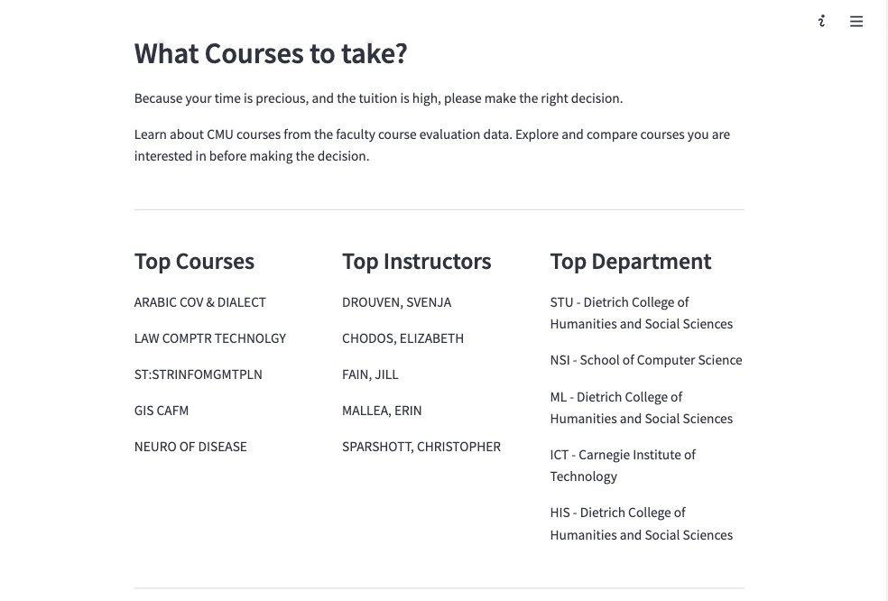
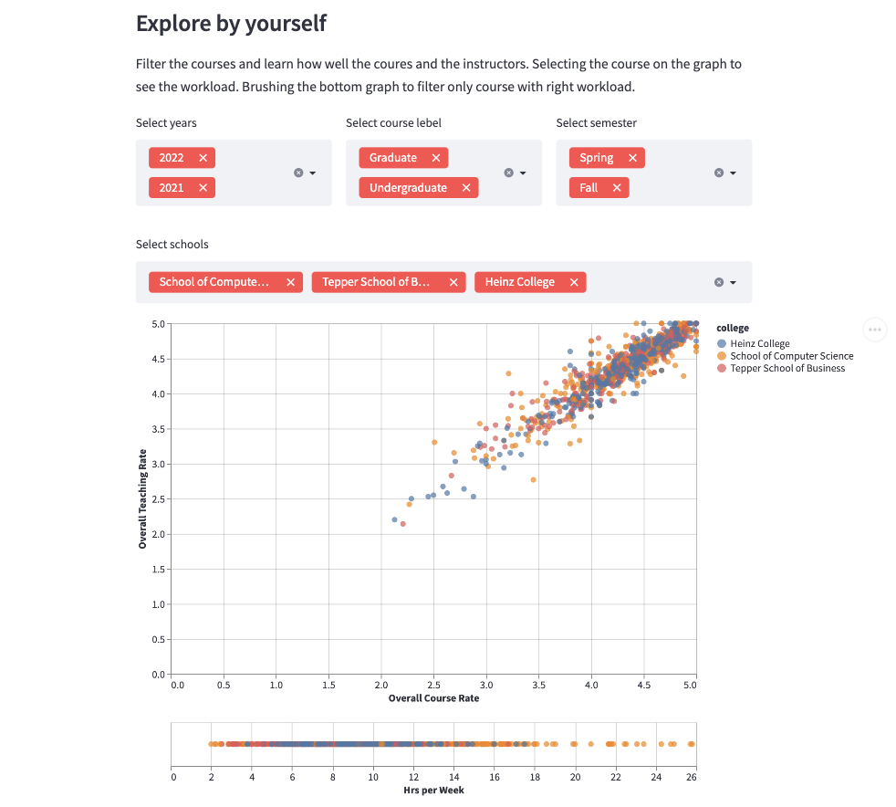
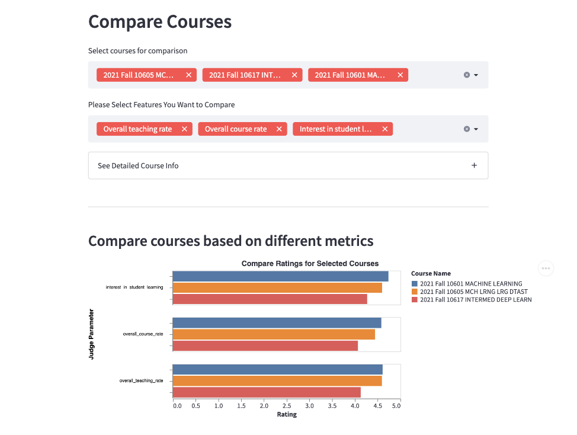
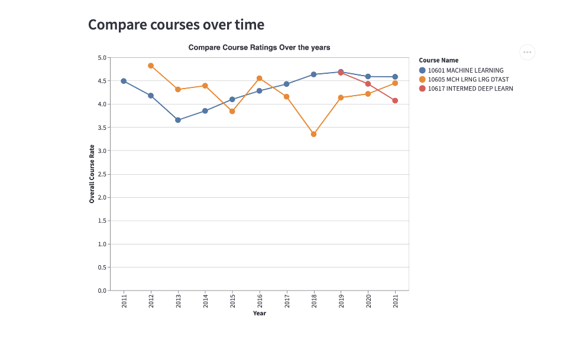

# CMU Interactive Data Science Final Project

- **Online URL**: [https://share.streamlit.io/cmu-ids-2022/final-project-the-evaluators/main/my_component/](https://share.streamlit.io/cmu-ids-2022/final-project-the-evaluators/main/my_component/)
- [**Report**](Report.md)
- [**Video Presentation**](https://drive.google.com/file/d/1wZm0hQv7E3lZ9IOPLl0j1T_6UTphbapW/view?usp=sharing)
- **Team members**:
  - Contact person: trachata@andrew.cmu.edu
  - jingyiso@andrew.cmu.edu
  - udt@andrew.cmu.edu
  - psasapar@andrew.cmu.edu

## Abstract

Course Evaluations are very critical and important for students as it helps them choose the right subjects for themselves and build their semester schedules. However, just seeing the results of course evaluations and making a decision is an arduous and tedious process. Thus, identifying this problem that is faced by most college students we proposed to build a website which helps students visualize this information and interact with the visualizations. Moreover, we depict the current trends as part of our home page, which describes the top courses, top instructors and top departments. We develop various modules to compare courses, instructors and departments. These modules help students answer a lot of their questions while selecting a course, such as if a course is offered by 2 instructors which is the better instructor, which professor gives less work and assignments and which professor might be more engaged with students. We also have built a search module for our project application which helps user search based on keywords. In our comparison module we also show the trend over the years, so if a course which had high rating before, but it has dropped over the years it might imply that course content is no longer that relevant. Thus, with our visualizations we facilitate users to gain potential insights about the course which might be critical in the decision making process. As part of our future work we would like to build a comprehensive application that gives course recommendations to users and also suggest alternative courses when a course is waitlisted or full.


 |  
:--------------------------------:|:-----------------------------------:
_Figure 1- Top 5 rated section_   |  _Figure 2 - Courses explorer visualization_

 |  
:------------------------------:|:---------------------------------:
_Figure 3 - Compare courses_    |  _Figure 4 - Compare courses over time_

## Run the app

- Ensure you have Python 3.6+, Node.js, and npm installed.
- clone the repository
- Create a new Python virtual environment for the template:

```
$ python3 -m venv venv  # create venv
$ . venv/bin/activate   # activate venv
$ pip install streamlit # install streamlit
```

- Initialize and run the component template frontend:

```
$ cd my_component/frontend
$ npm install    # Install npm dependencies
$ npm run start  # Start the Webpack dev server
```

- From a separate terminal, run the template's Streamlit app:

```
$ . venv/bin/activate  # activate the venv you created earlier
$ streamlit run my_component/__init__.py  # run the example
```

## Work distribution

Update towards the end of the project.

## Deliverables

### Proposal

- [x] A completed [Proposal](https://github.com/CMU-IDS-2022/final-project-the-evaluators/blob/main/Proposal.md)

### Sketches

- [x] Develop sketches/prototype of your project.

### Final deliverables

- [x] All code for the project should be in the repo.
- [x] Update the **Online URL** above to point to your deployed project.
- [x] A detailed [project report](Report.md). Each student should submit the URL that points to this file in their github repo on Canvas.
- [x] A 5 minute video demonstration. Upload the video to this github repo and link to it from your report.
